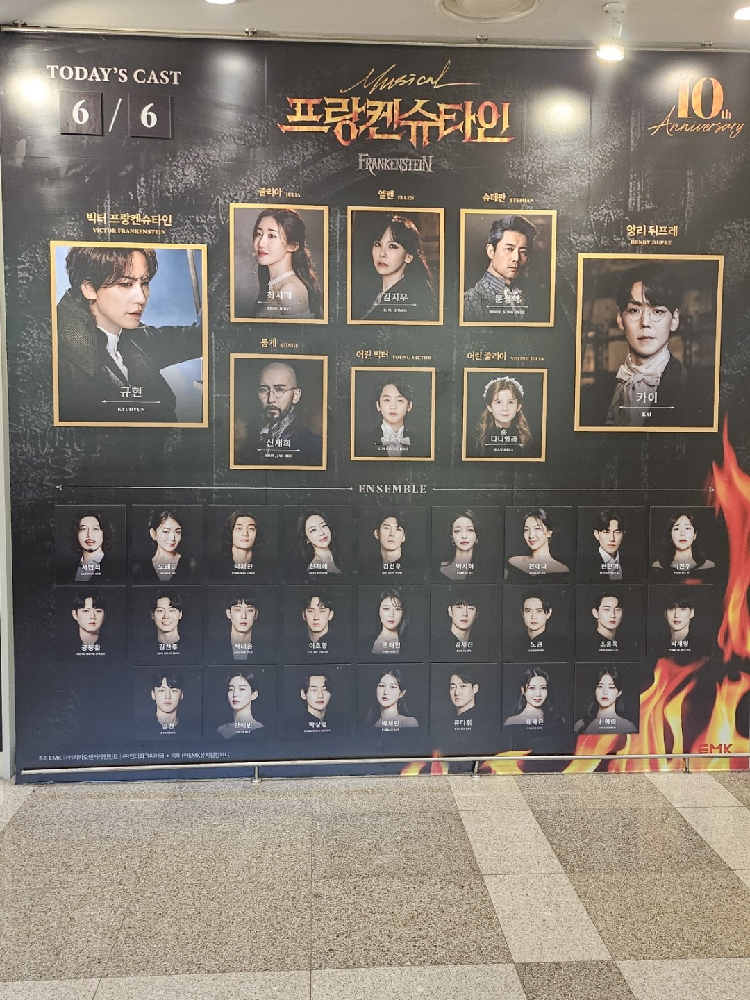
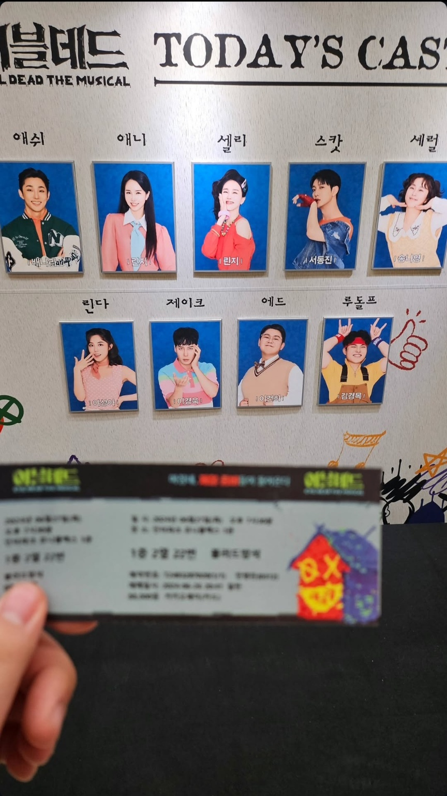
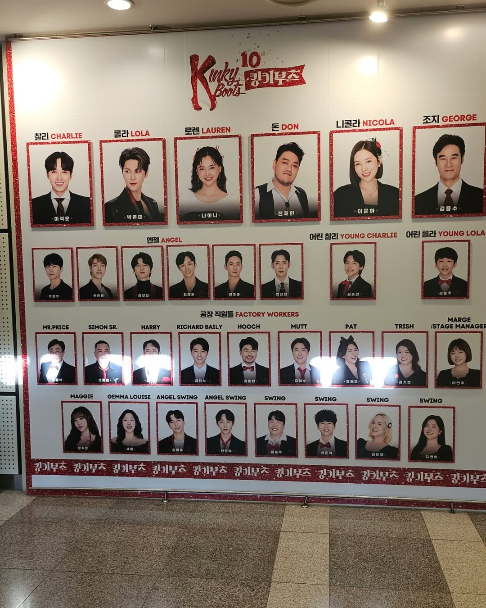
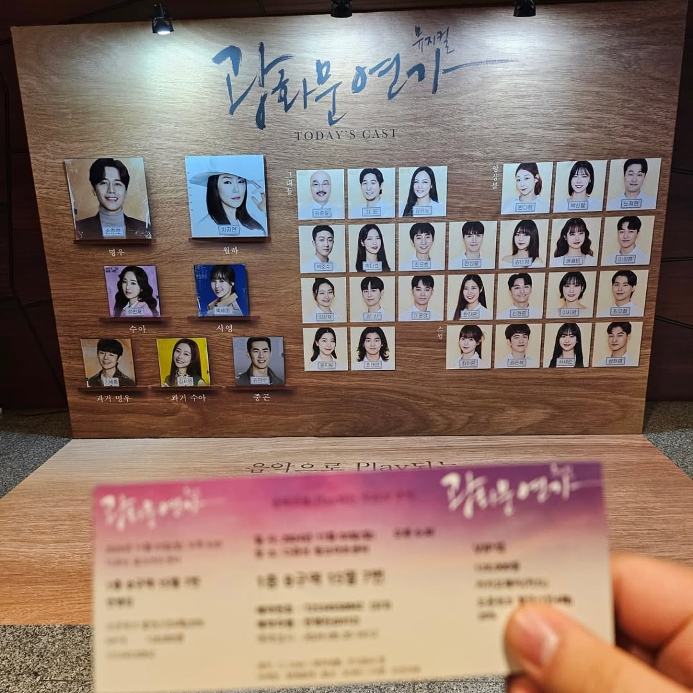
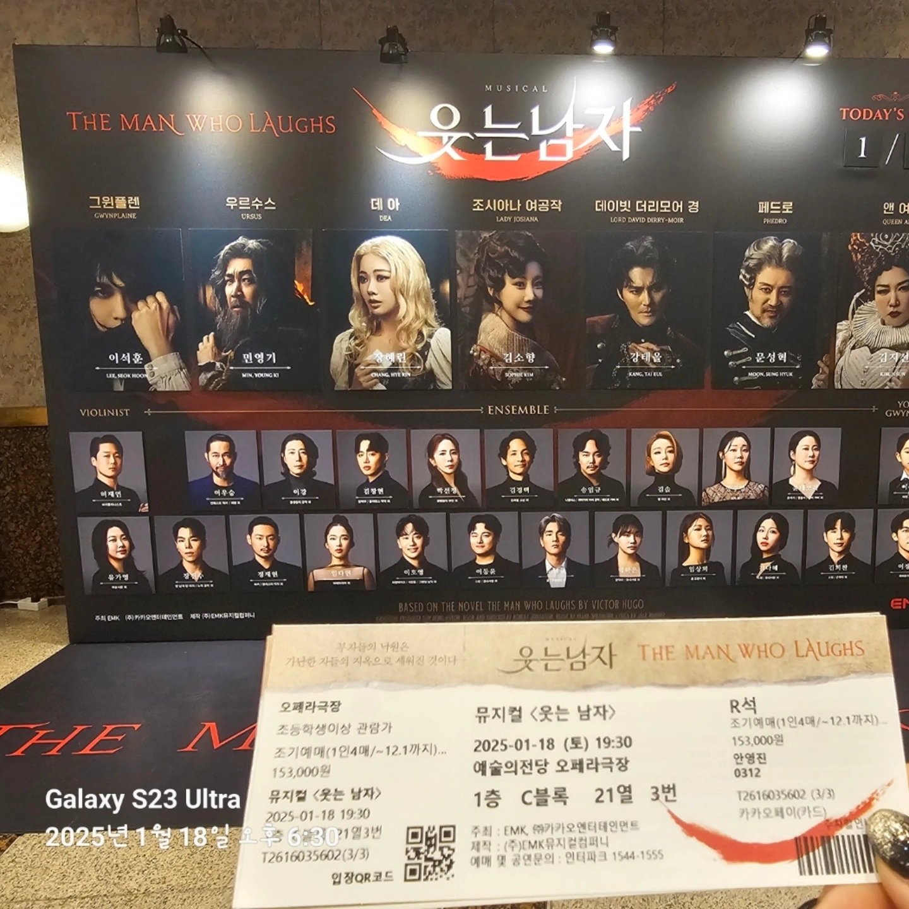
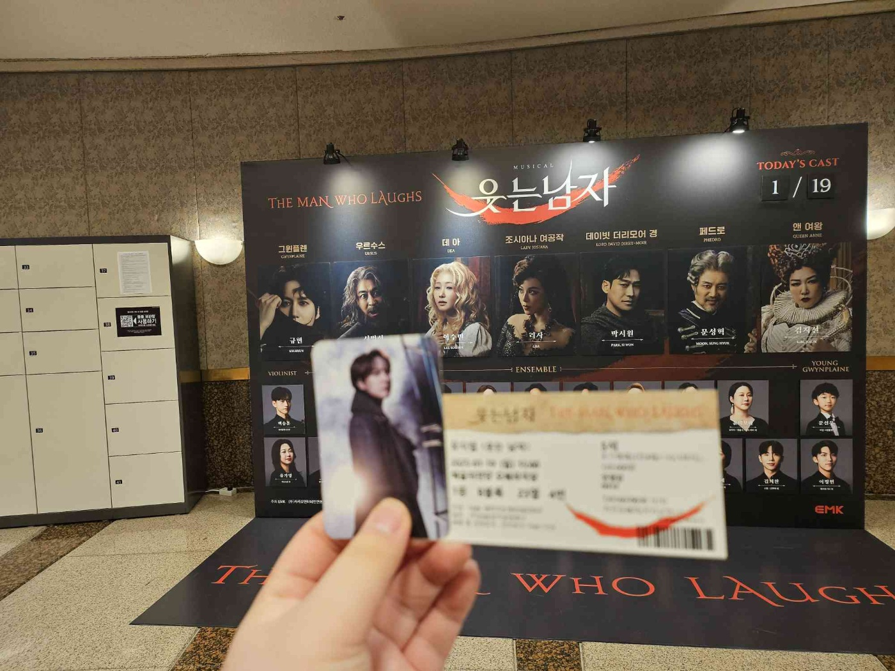
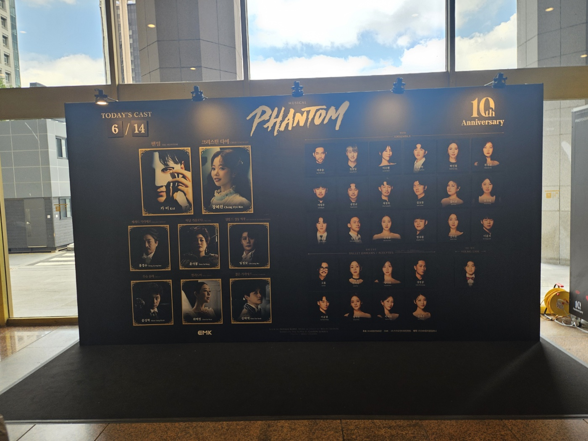

# 안영진 (anyoungjin)

## 자기소개

안녕하세요! 저는 다양한 프로그래밍 언어를 공부해온 안영진입니다.

## 경력

- 前)계양구 청소년 수련관 AI활용 강사

## 기술
### os
- ****
- ****

### 언어 및 프레임워크
- ****
  - 
    - 
    - 
- ****
  - 
  - 
  - 

### 사용하는 도구
- **IDE**
   - 
   - 
   - 
   - 
   - 
- ****
  - 
- ****
  - 
  - 
  - 
- **클라우드**
  - 
  - 

- **기타**
  - 

## 관심사

- **닌텐도**
  - 
  - 
  - 
  - 
- **뮤지컬**
  - 프랑켄슈타인
    
  - 이블데드
    
  - 킹키부츠
    
  - 광화문 연가
    
  - 웃는남자
    
    
  - 팬텀
    

## 논문

1. **A Real-Time Tourist Information and AR Experience System Using FastAPI and Unity**
   🔗 [논문 링크](https://www.kci.go.kr/kciportal/ci/sereArticleSearch/ciSereArtiView.kci?sereArticleSearchBean.artiId=ART003176565)
   🗂️ **주제:** 실시간 관광 정보 제공 및 AR 경험 시스템
   🛠️ **기술 스택:** ,

[]
